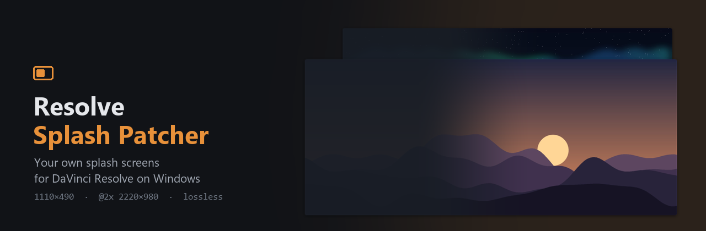
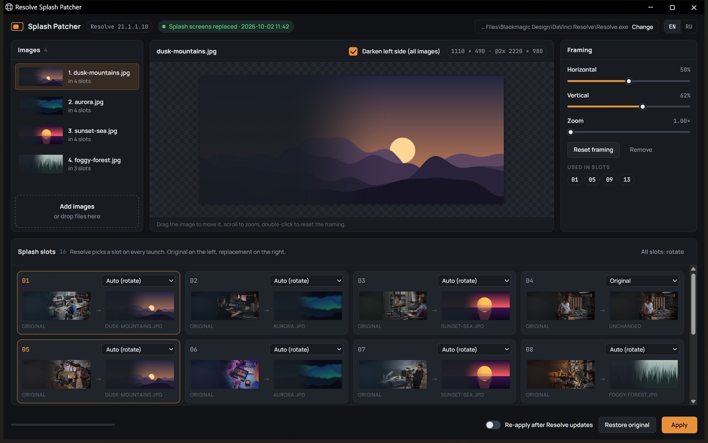
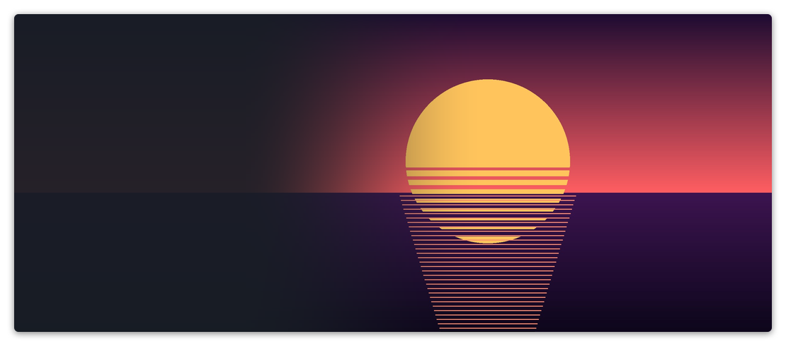

<!-- Downloads -->

[latest-release]: https://github.com/turboenotak/davinci-resolve-splash-patcher/releases/latest
[download-zip]: https://github.com/turboenotak/davinci-resolve-splash-patcher/releases/latest/download/ResolveSplashPatcher.zip
[python-link]: https://www.python.org/downloads/

<!-- Badges -->

[badge-platform]: https://img.shields.io/badge/platform-Windows-0078D4
[badge-python]: https://img.shields.io/badge/python-3.10%2B-3776AB
[badge-license]: https://img.shields.io/github/license/turboenotak/davinci-resolve-splash-patcher
[badge-release]: https://img.shields.io/github/v/release/turboenotak/davinci-resolve-splash-patcher

<!-- Other -->

[issues-link]: https://github.com/turboenotak/davinci-resolve-splash-patcher/issues
[license-link]: LICENSE
[reddit-post]: https://www.reddit.com/r/davinciresolve/comments/1k2jy2d/custom_davinci_resolve_splash_screen/

<!-- Content -->

<div align="center">
  <h1>Resolve Splash Patcher</h1>
  <p>Replace the DaVinci Resolve splash screens with your own images, and keep them after every update</p>

[Installation](#installation) ·
[Usage](#usage) ·
[How it works](#how-it-works) ·
[FAQ](#faq)

[![platform][badge-platform]][latest-release]
[![python][badge-python]][python-link]
[![release][badge-release]][latest-release]
[![license][badge-license]][license-link]

  
</div>

---

> This is an unofficial tool. It is not affiliated with or endorsed by Blackmagic Design. DaVinci Resolve is a trademark of Blackmagic Design Pty. Ltd. The patcher modifies `Resolve.exe` on your computer; use it at your own risk.

## Installation

> [!IMPORTANT]
> Windows only. You need **[Python 3.10 or newer][python-link]**. When installing Python, tick **"Add python.exe to PATH"**.

1. Download **[ResolveSplashPatcher.zip][download-zip]** from the [latest release][latest-release] and extract it anywhere.
2. Double-click **`Start.bat`**. On the first run it installs [Pillow](https://pypi.org/project/pillow/), the only dependency.
3. The interface opens in its own window. Nothing is changed until you click **Apply**.

Or clone the repository:

```bash
git clone https://github.com/turboenotak/davinci-resolve-splash-patcher.git
```

## Usage

<div align="center">
  
</div>

1. **Add images** with the button or drop files onto the window. Any size and aspect ratio works.
2. Select an image and frame it: drag it in the preview, scroll to zoom, double-click to reset. The sliders on the right do the same.
3. Keep **Darken left side** on if you want the stock look. It adds the same dark panel as the original splash screens, so the Resolve title and loading text stay readable on bright images.
4. Check the **Splash slots** strip. Each card shows the original on the left and its replacement on the right. By default your images rotate across all slots; each slot's list lets you pick a specific image or keep the original.
5. **Close DaVinci Resolve** and click **Apply**. Windows asks for administrator permission, because `Resolve.exe` lives in `Program Files`.
6. Start Resolve and enjoy.

> [!TIP]
> Turn on **Re-apply after Resolve updates**. Updating Resolve replaces `Resolve.exe` and brings the stock splash screens back. With this switch on, a Task Scheduler task re-applies your saved images after an update or at your next sign-in, without opening any windows.

**Restore original** puts the original bytes back from the backup at any time.

## Features

- Replaces both splash sets: 1110 × 490 for 100% Windows scaling and @2x 2220 × 980 for HiDPI screens
- Lossless: images are stored as full-quality PNG, no squeezing to match the original file size
- Keeps the original drop shadow and rounded corners, taken from the stock splash screens
- Live preview that matches the final result, with drag to pan and scroll to zoom
- Optional dark panel on the left, measured from the stock images
- Up to 16 different images; Resolve picks one of them on every launch
- Automatic re-apply after Resolve updates
- Backup and one-click restore, verified byte for byte
- No hard-coded offsets: the resource tables are located by their signatures, so new Resolve versions work without an update
- English and Russian interface

What the patched splash screens look like (demo images, darkening on):

<p align="center">
  
  
</p>

## How it works

The splash screens are not separate files. They are Qt resources compiled into `Resolve.exe`, and there are two independent sets:

| Set | Resource names | Size | Used when |
|---|---|---|---|
| 1x | `:/Application/Misc/ResolveSplashScreen1` … `16` | 1110 × 490 | Windows display scaling is 100% |
| 2x | `:/Application/Misc/ResolveSplashScreen1@2x` … `16@2x` | 2220 × 980 | Display scaling is above 100% |

Each set is a Qt resource with three tables: names, a tree, and data. Every data entry is a 4-byte size followed by a PNG, and the tree points to it by offset.

Replacing images by hand in a hex editor means the new PNG must be no larger than the original, which forces heavy compression. The patcher does it differently:

1. Finds the name, tree and data tables of each set by their signatures.
2. Treats the data of every splash entry as free space and merges neighbours into large regions: about 21 MB for 1x and 44 MB for 2x. The 1x set also contains 16 Linux-only variants that Windows never shows, which adds more room.
3. Renders your images onto the original shadow and corner mask, writes the PNGs into that space and repoints the tree.
4. Checks every slot by decoding it again.

Sixteen different images take about 9 MB in the 1x set and 31 MB in the 2x set, so nothing has to be compressed. If space ever runs out, only the heaviest images are reduced to a 256-colour palette.

Before the first patch the original bytes are saved to `%APPDATA%\ResolveSplashPatcher\backups\<version>`. Re-applying always starts from that original layout.

### Command line

```bash
python splash_patcher.py --apply     # apply the saved settings
python splash_patcher.py --auto      # apply only if Resolve is not patched yet
python splash_patcher.py --restore   # restore the original splash screens
```

Settings are stored in `%APPDATA%\ResolveSplashPatcher\config.json`, together with copies of your images (`images\`) and a log (`patcher.log`).

## FAQ

**I still see the original splash screens.**
Check the status in the top bar. It should say *Splash screens replaced*. If it says *Not every set is replaced*, click **Apply** again. Make sure every slot has an image if you never want to see a stock splash.

**Resolve updated and my splash screens are gone.**
Open the patcher and click **Apply**, or turn on **Re-apply after Resolve updates** so it happens automatically.

**Does it work on macOS or Linux?**
No. The Windows build of Resolve is the only one supported.

**Is it safe?**
The patcher only rewrites the splash screen resources, and it backs up the original bytes first. Patching changes the file's digital signature, which does not stop Resolve from starting. If anything goes wrong, use **Restore original** or repair Resolve with its installer.

**How do I uninstall it?**
Click **Restore original**, switch off **Re-apply after Resolve updates**, then delete the folder and `%APPDATA%\ResolveSplashPatcher`.

**Something went wrong.**
Open an [issue][issues-link] and attach `%APPDATA%\ResolveSplashPatcher\patcher.log` and your Resolve version.

## Project structure

| File | Purpose |
|---|---|
| `splash_patcher.py` | Resource parser, renderer, patcher, command line and the local server for the interface |
| `ui.html` | The interface (opens in a Microsoft Edge app window) |
| `Start.bat` | Launcher that checks Python and installs Pillow |

## License

[MIT][license-link]. The original idea and manual method are in [this Reddit post][reddit-post].
